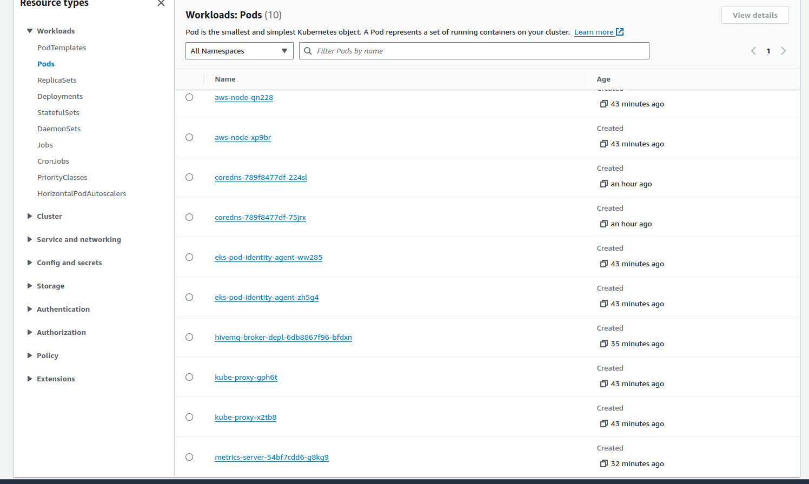

# Configuração do cluster Kubernetes para nuvem AWS

## Cluster Kubernetes instalado na nuvem AWS
- Ver a pasta [**hivemqAWS**](./hivemqAWS).

## 1) Restrições da conta Academy:

##### <span id="anchor"></span>Amazon Elastic Kubernetes Service (EKS)

- This service can assume the LabRole IAM role.
- Supported Instance types: nano, micro, small, medium, and large.

## 2) Criando o cluster

### 2.1) Criando a VPC
```
douglas@douglas-ipt:~$ aws cloudformation create-stack --region us-east-1 --stack-name hivemq-broker-stack --template-url https://s3.us-west-2.amazonaws.com/amazon-eks/cloudformation/2020-10-29/amazon-eks-vpc-private-subnets.yaml

{
    "StackId": "arn:aws:cloudformation:us-east-1:956590891766:stack/hivemq-stack/04c1d850-7e79-11ef-acc9-0affda5e87ab"
}

```
### 2.2) Criando o cluster usando o Role LabRole


### 2.3) Atualizando o kubeconfig local
```
douglas@douglas-ipt:~$ aws eks update-kubeconfig --region us-east-1 --name hivemq-cluster
Added new context arn:aws:eks:us-east-1:956590891766:cluster/hivemq-cluster to /home/douglas/.kube/config

```

```
douglas@douglas-ipt:~$ kubectl get svc
NAME         TYPE        CLUSTER-IP   EXTERNAL-IP   PORT(S)   AGE
kubernetes   ClusterIP   10.100.0.1   <none>        443/TCP   9m55s
```

## 2.4) Criando os nós via instâncias EC2 – Role LabRole

Nós adicionados via interface web do AWS EKS.


## 2.5) Fazendo o deploy do hivemq

```
douglas@douglas-ipt:~$ kubectl create namespace hivemq-namespace
namespace/hivemq-namespace created

```
```
douglas@douglas-ipt:~$ kubectl apply -f hivemq-deployment.yaml 
deployment.apps/hivemq-broker-depl created
```
```
douglas@douglas-ipt:~$ kubectl apply -f hivemq-service.yaml 
service/hivemq-service created
```





## 2.6) Deploy do Metrics Server

```
douglas@douglas-ipt:~$ kubectl apply -f https://github.com/kubernetes-sigs/metrics-server/releases/latest/download/components.yaml
serviceaccount/metrics-server created
clusterrole.rbac.authorization.k8s.io/system:aggregated-metrics-reader created
clusterrole.rbac.authorization.k8s.io/system:metrics-server created
rolebinding.rbac.authorization.k8s.io/metrics-server-auth-reader created
clusterrolebinding.rbac.authorization.k8s.io/metrics-server:system:auth-delegator created
clusterrolebinding.rbac.authorization.k8s.io/system:metrics-server created
service/metrics-server created
deployment.apps/metrics-server created
apiservice.apiregistration.k8s.io/v1beta1.metrics.k8s.io created
```

## 2.7) Habilitando o HPA

```
douglas@douglas-ipt:~$ kubectl autoscale deployment hivemq-broker-depl --cpu-percent=70 --min=1 --max=20
horizontalpodautoscaler.autoscaling/hivemq-broker-depl autoscaled

douglas@douglas-ipt:~$ kubectl get hpa
NAME                 REFERENCE                       TARGETS       MINPODS   MAXPODS   REPLICAS   AGE
hivemq-broker-depl   Deployment/hivemq-broker-depl   cpu: 3%/70%   1         20        1          38s

```
